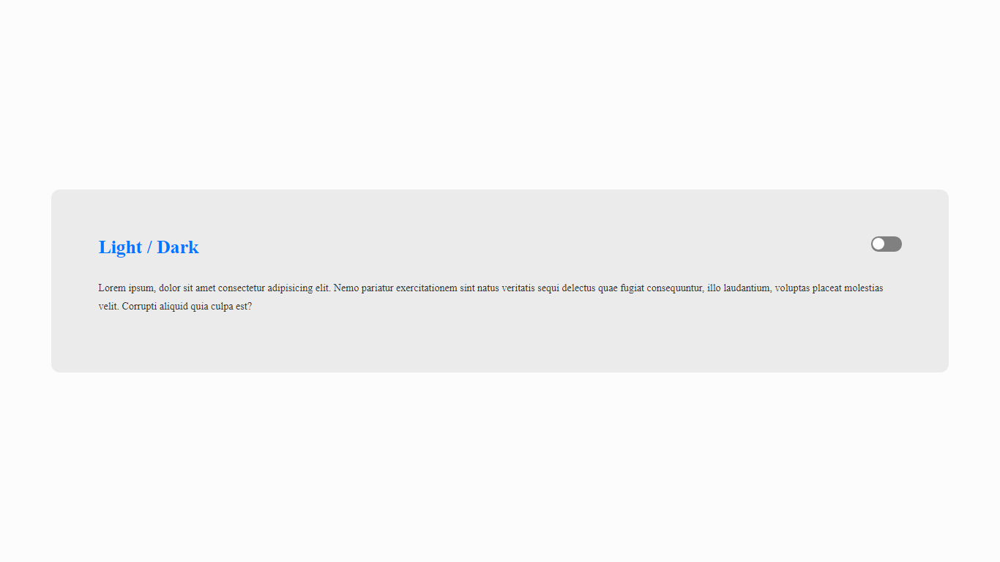
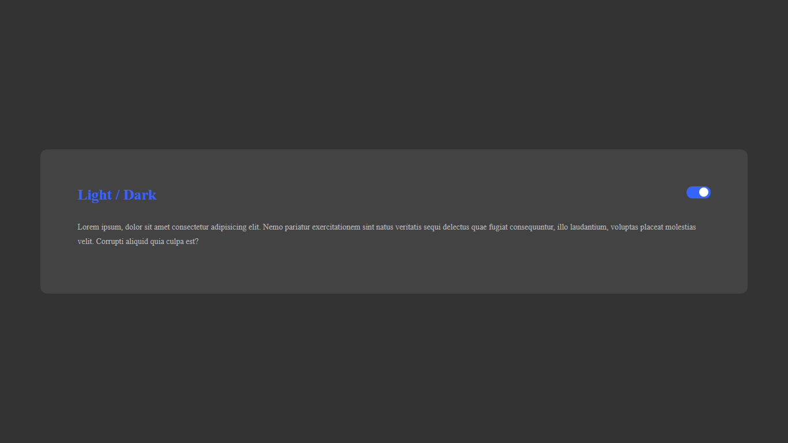

<strong> Dark Mode raiz com CSS e JavaScript </strong>

<h1 align="center"> DARK MODE </h1>

Treinar um pouco dos conhecimentos de <strong>JavaScript</strong> puro, juntamente com Variáveis no CSS.

---
Feito com ♥ by Tharlys Dias